# Disadv68 keyboard

This keyboard is a fork of [dactyl-cc](https://github.com/adereth/dactyl-keyboard).

The prototype:


Differences with *dactyl-cc* and some notes:

- Fixed switch hole sizes (if you print the current version of *dactly-cc*, you will have a bad time).
- Fixed screw hole sizes for M3 screws and "threaded brass insert" ([AliExpress](https://www.aliexpress.com/item/1005004870993068.htm)).
    

- Original [Kinesis Contoured](https://deskthority.net/wiki/Kinesis_Contoured) keycaps are from ABS and are very expensive (50EUR + shipping).
  *Solution* (use OEM and DSA keycaps). Due to different naming conventions for numbering rows, we will define them as
    

  Here is a list of which keycaps you will need (ABS for < 10EUR, PBT < 20EUR):
  - 18 pcs of `1x1u` OEM `R1` (`ZXCV` row),
  - 2  pcs of `2x1u` vertical OEM `R1` (≡ `Numpad Enter` keycap),
  - 2  pcs of `1x2u` horizontal OEM `R1` (≡ `Numpad 0` keycap).
  - 10 pcs of `1x1u` OEM `R2` (`ASDF` row),
  - 12 pcs of `1x1u` OEM `R3` (`QWER` row),
  - 12 pcs of `1x1u` OEM `R4` (`1234` row),
  - 4  pcs of `1x1u` OEM `R5` (`F1F2F3F4` row),
  - 8  pcs of `1x1u` DSA with the deep dish ("blind" keycaps) — you can replace DSA keycaps with `1x1u` OEM `R2` keycaps.
  
  

  The `1u` OEM `R5` keycaps are very rare, so we opted for `R4` keycaps instead. To compensate keycap height difference, we raised the switch sockets/holes by 3mm.
  The `1x1.25u` OEM `R2`s are also very rare so we opted out for `1u` keycaps.
  Note that Cherry stems are not "fully symmetric", therefore if you want to rotate the keycap by 90°, you also need to rotate the switch:

  
  
  Sometimes `Numpad Enter` keycaps have rotated stems (therefore, on the standard keyboard the key switch will be placed sideways). Consult with your keycaps vendor if this is the case (it was in ours). This is important because switch sockets have side nubs.
  The current version of the keyboard hull has both sockets with `Numpad Enter` and `Numpad 0` keycaps rotated.

  The other option is to 3D print keycaps. We were unsuccessful in FDM printing — it is hard to get the keycap stems right. Probably the best option is to use [stereolithography](https://en.wikipedia.org/wiki/Stereolithography). If you want to generate the 3D models we suggest you look at the [Parametric Mechanical Keycap Library](https://github.com/rsheldiii/KeyV2).

## FDM printing settings

- Machine Type: Creator 3 Pro
- Material: ASA
- Layer Height: 0.1mm
- Shell Count: 3
- Fill Density: 25%
- Fill Pattern: Hexagon
- Print Speed: 50mm/s
- Travel Speed: 80mm/s
- Extruder Temperature: 250°C
- Platform Temperature: 110°C
- First layer: 0.3mm
- Raft: yes

Due to the long printing time — 50 hours for each side and the small nozzle size, it is very likely that the extruder will get clogged.

## Building STL files

1. Apply your modification to the code. Here are the labels of the key sockets used in the code:
   

2. Compile ("requires" CMake).

    ```bash
    cd build
    ./build.sh
    ```

3. Install [OpenSCAD](https://openscad.org/downloads.html) (*Development Snapshot* is the best choice). Files `.scad` will be generated in the folder `build`.

4. Generate STL files.

For measuring distances on STL files we recommend [Blender](https://www.blender.org/).
For post-processing and quick edits, we recommend [Thinkercad](https://www.tinkercad.com).

## Assembly and firmware

Our choice for the microcontroller is `WeAct BlackPill STM32F411CEU6`:

- [QMK docs on blacpill](https://docs.qmk.fm/#/platformdev_blackpill_f4x1?id=weact-blackpill-stm32f4x1)
- [WeAct Studio's blackpill repository](https://github.com/WeActStudio/WeActStudio.MiniSTM32F4x1)

In the folder `things` you can find some custom STLs:

- Custom bottom plate with recesses for USB cable and 12-wire ribbon cable, and modified holes for M3 flat/countersunk head screws.

  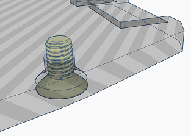

- A case for blackpill microcontroller.
  
  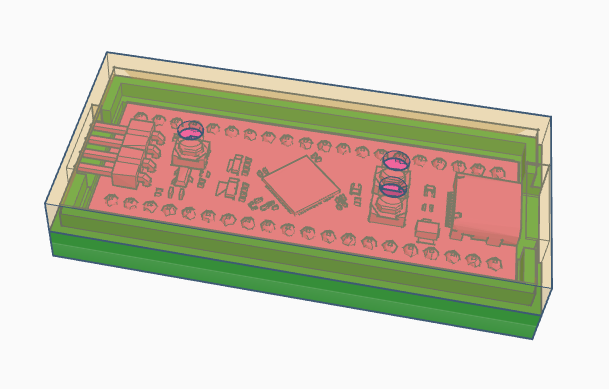

Note. With low RPM you can easily drill into ASA material.

### What do you need

- 2m of an old hard UTP cable (0 EUR)
- an old floppy drive ribbon cable (or any other ribbon cable, 0EUR)
- 10 pcs of 6mm M3 flat/countersunk/Philips head screws (0.5EUR)
- 10 pcs threaded brass insert (1EUR from Aliexpress)
- keycaps (<10EUR for ABS, <20EUR for PBT on Aliexress — contact the store)
- 68 pcs cherry-like key switches. We have bought 110 Gateron Pro Yellow V2 2.0 for 18EUR (good build quality, linear, pre-lubed).
- WeAct BlackPill STM32F411CEU6 ([where to buy](https://github.com/WeActStudio/WeActStudio.MiniSTM32F4x1#legitimate-purchase-links-as-well-as-pirated-links) 7EUR)
- 24-pin female header for the microcontroller
- 100 1N4148 diodes (0.75EUR)
- Soldering iron with adjustable temperature (borrow, otherwise We recommend [PINEICL](https://pine64.com/product/pinecil-smart-mini-portable-soldering-iron/) or a cheap one on Aliexpress)
- Solder
- Tweezers with a tiny head
- Wirecutter
- Razor knife
- Scissors pliers for wire stripping (that support small wires)
- USB-C cable
- Multimeter
- Hot glue gun
- Around 25 hours of spare time
- ...

### Assembly

1. Clean up/remove support from the printed hull.
   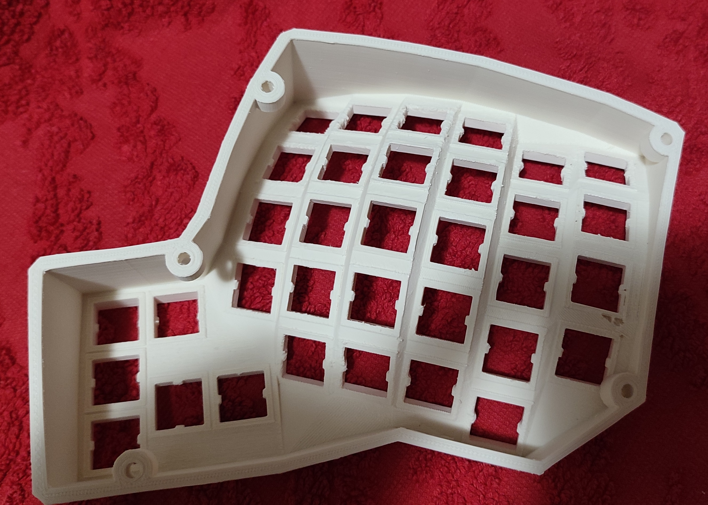
   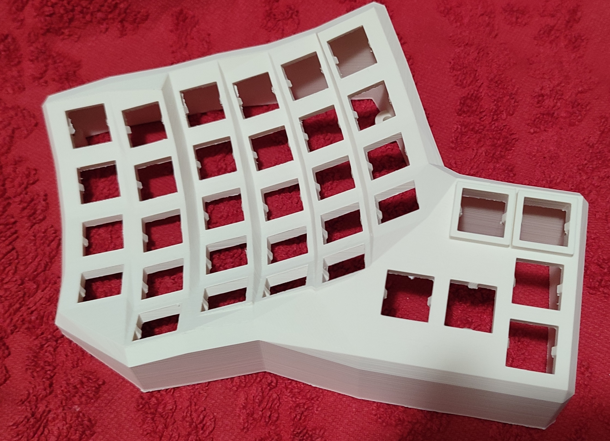

2. Add switches and keycaps
   

3. Stabilize switches with hot glue.

4. Place wires for the columns (if you start with rows first, it is harder to replace diodes/switches later).

     - Extract/unwind wires from the UTP cable
     - Make a hook.
        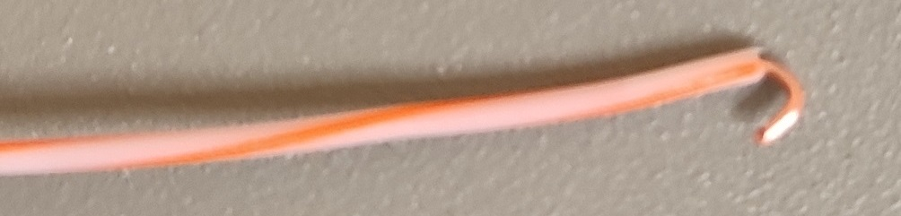
     - Hook up the wire to the top row pin and mark the position for the rest of the pins.
       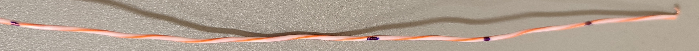
     - Using the scissors pliers for wire stripping cut the insulator for each mark twice. Then use a Razor knife to partially peel off the insulator.
     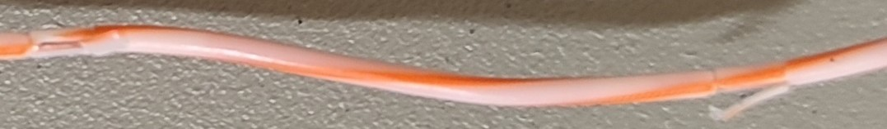
     - Remove the rest of the insulator using tweezers.
     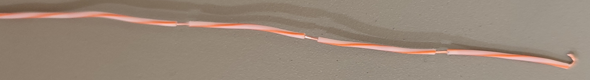
     - Apply flux and solder the column wires to the switch pins.
     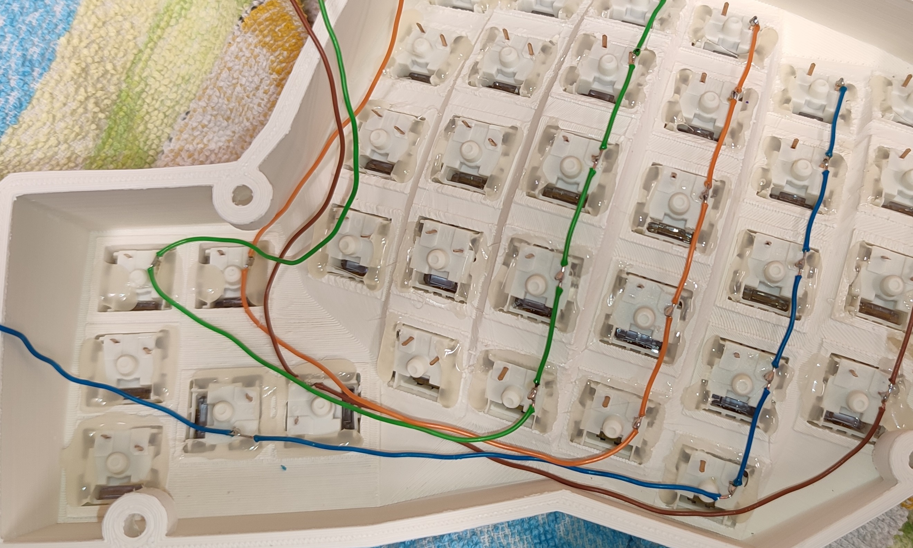

5. Make rows from diodes (start with making "eyes") — double-check the orientation of diodes.
     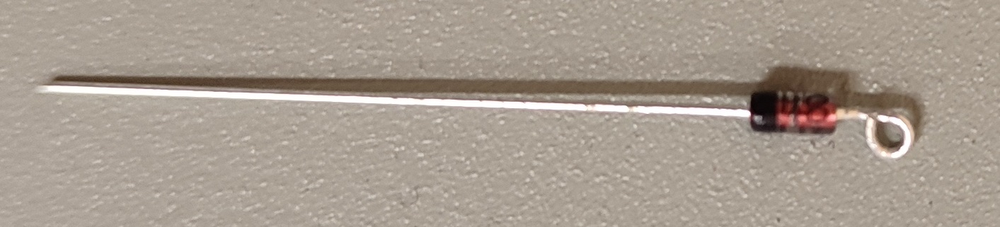
     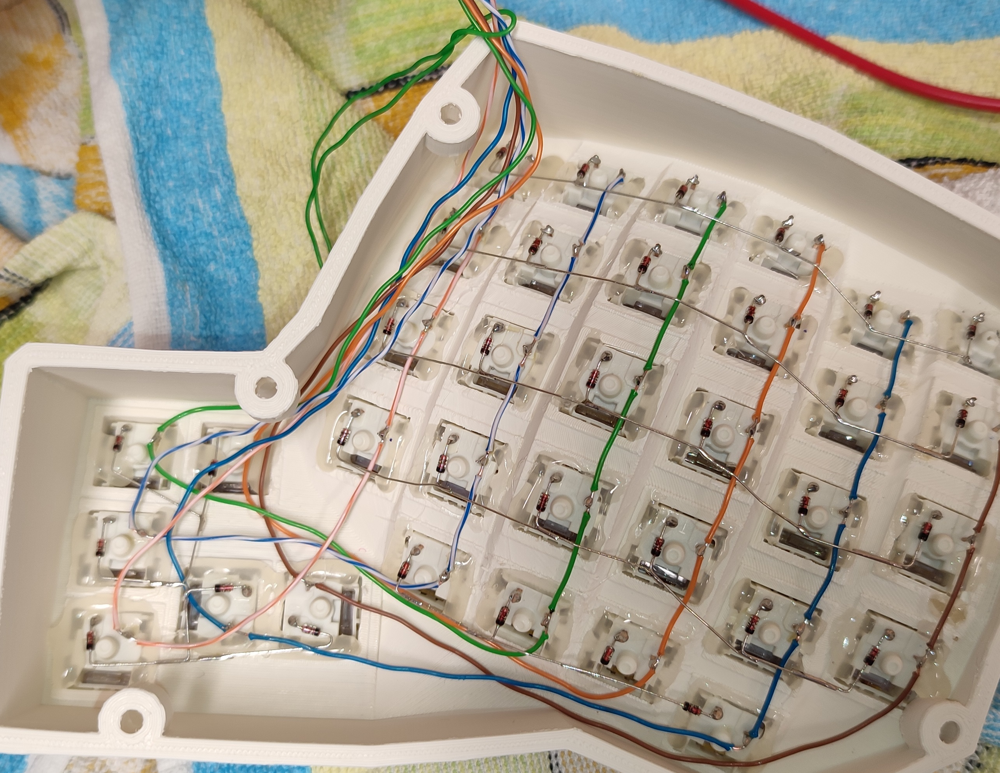

6. Connect wires to the female header for the microcontroller.
  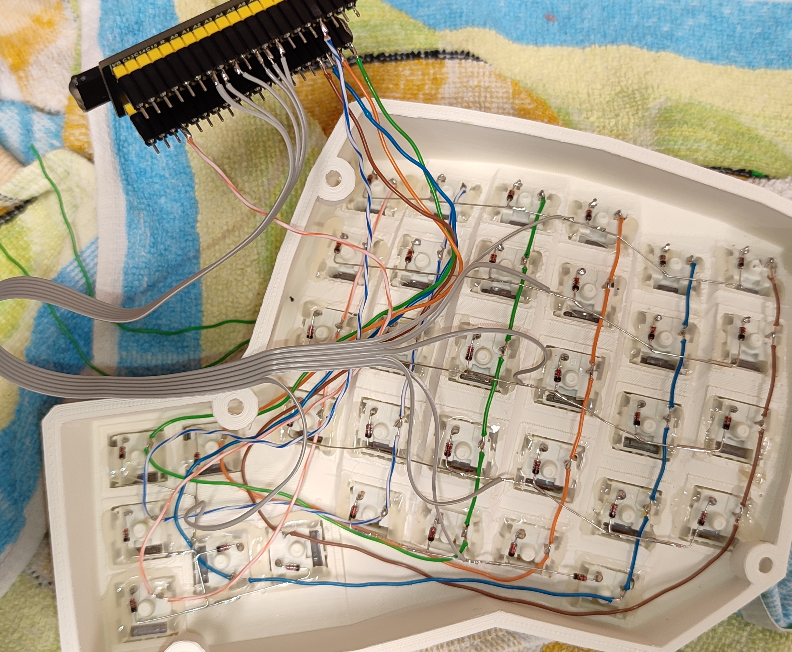

7. Test the left side of the keyboard (flash the microcontroller first).
8. Make the right side.
9. Insert screw inserts slowly using soldering iron at 200°C.
  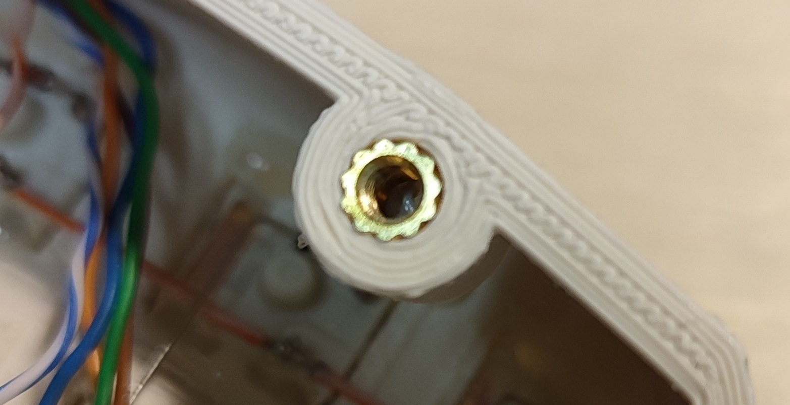
10. Connect the left and the right side with a 12-wire ribbon (6 columns and 6 rows) cable according to your firmware settings.
11. Connect [USB wires](https://en.wikipedia.org/wiki/USB_hardware) to the female header for the microcontroller (`D-` → `A11`, `D+` → `A12`, `+5V` → `5V`, and `GND` → `G`). This will reduce the footprint of the microcontroller inside the keyboard hull.
12. Secure the wires with hot glue.
13. Make the bottom plates. Our 3D printer had problems. So we used 4mm plywood with longer (8mm) M3 screws. Here is the design for the wooden bottom plate — [bottom_left](things/custom_bottom_plate/bottom_left.svg) and [bottom_right](things/custom_bottom_plate/bottom_right.svg). These designs do not take into account the ASA shrinkages. You need to do modifications on your own.
14. Use M3 screws to secure the bottom plates
15. Add pads to the bottom plates (you can make them from an old mousepad).
16. Walla, you should have a functional keyboard now.
   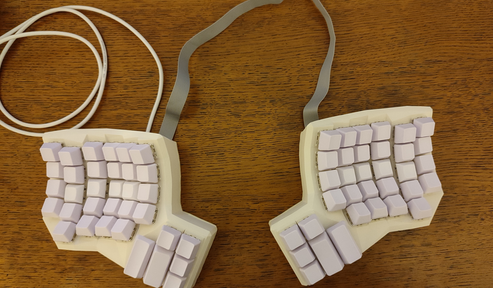

### Firmware

...can be found [here — qmk_firmware](https://github.com/tree-in-forest/qmk_firmware/tree/disadv68/keyboards/handwired/disadv68).

### Layout

The default layout is:

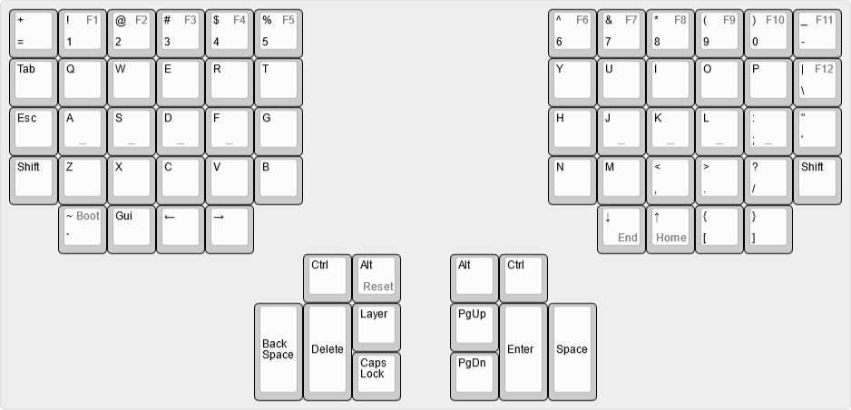

- To access F-keys use the Layer key.
- Reset the keyboard: `Layer + RAlt`
- Jump to the bootloader ``Layer + ` ``

Nice layouts to check out:

- [The Hands Down™ Layout](https://sites.google.com/alanreiser.com/handsdown)

## Traveling case

Coming soon.

## Wrist rests

Coming soon.

## Adjustable tilting supports

Coming soon.
