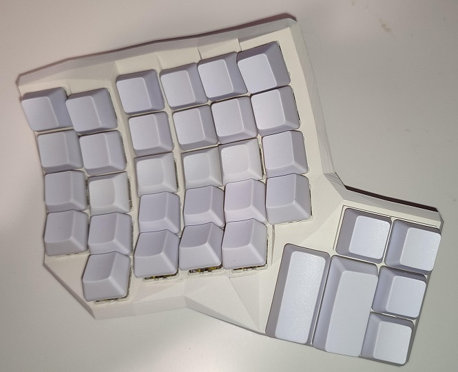
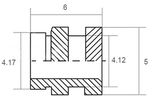
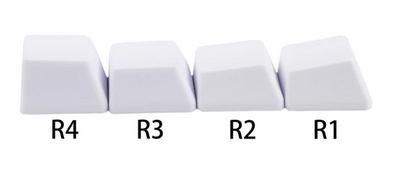
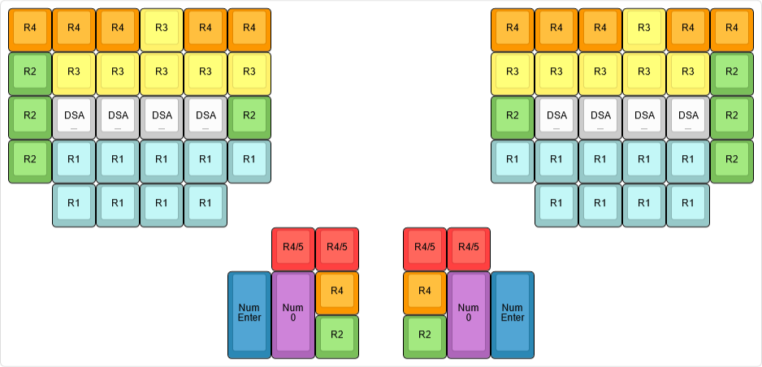
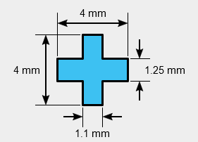
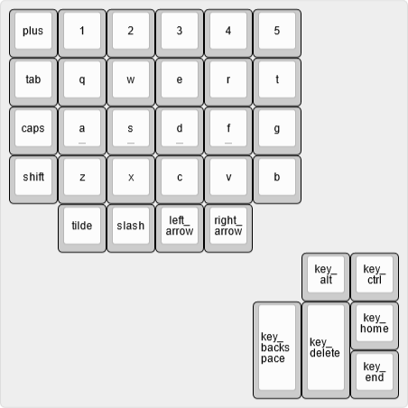

# Disadvantage 68 keyboard

This keyboard is a fork of [dactyl-cc](https://github.com/adereth/dactyl-keyboard).



Differences with *dactyl-cc* and some notes:

- Fixed switch hole sizes (if you print the current version of *dactly-cc*, you will have a bad time).
- Fixed screw hole sizes for M3 screws and "threaded brass insert" ([AliExpress](https://www.aliexpress.com/item/1005004870993068.htm)).
    
- Original Kinesis (advantage series) keycaps are from ABS and very expensive (50EUR + shipping).
  *Solution* (use OEM and DSA keycaps). Due to different naming conventions for numbering rows, we will define them as:
    
  Here is a list of which keycaps you will need (ABS for < 10EUR, PBT < 20EUR):
  - 18 pcs of `1x1u` OEM `R1` (`ZXCV` row),
  - 2  pcs of `2x1u` vertical OEM `R1` (≡ `Numpad Enter` keycap),
  - 2  pcs of `1x2u` horizontal OEM `R1` (≡ `Numpad 0` keycap).
  - 10 pcs of `1x1u` OEM `R2` (`ASDF` row),
  - 12 pcs of `1x1u` OEM `R3` (`QWER` row),
  - 12 pcs of `1x1u` OEM `R4` (`1234` row),
  - 4  pcs of `1x1u` OEM `R5` (`F1F2F3F4` row),
  - 8  pcs of `1x1u` DSA with the deep dish ("blind" keycaps) — you can replace DSA keycaps with `1x1u` OEM `R2` keycaps.
  
  

  The `1u` OEM `R5` keycaps are very rare, so we opted for `R4` keycaps instead. To compensate the keycap height difference, we raised the switch sockets/holes by 3mm.
  The `1x1.25u` OEM `R2` are also very rare so we opted out for `1u` keycaps.
  Note that Cherry stems are not "fully symmetric", therefore if you want to rotate the keycap by 90°, you also need to rotate the switch:
  
  
  Sometimes `Numpad Enter` keycaps have rotated stem (therefore, on the standard keyboard the key switch will be placed sideways). Consult with your keycaps vendor if this is the case (it was in ours). This is important because switch sockets have side nubs.
  Current version of the keyboard hull has both sockets with `Numpad Enter` and `Numpad 0` keycaps rotated.

## FDM printing settings

Machine Type: Creator 3 Pro
Material: ASA
Layer Height: 0.1mm
Shell Count: 3
Fill Density: 25%
Fill Pattern: Hexagon
Print Speed: 50mm/s
Travel Speed: 80mm/s
Extruder Temperature: 250°C
Platform Temperature: 110°C
First layer: 0.3mm
Raft: yes

Due to long print — 50 hours for each side and small nozzle size, it is very likely that your extruder will get clogged.

## Building STL files

1. Apply your modification to the code. Here are the labels of the key sockets used in the code:
   

2. Compile ("requires" CMake).

    ```bash
    cd build
    ./build.sh
    ```

3. Install [OpenSCAD](https://openscad.org/downloads.html) (*Development Snapshot* is the best choice). Files `.scad` will be generated in folder `build`.

4. Generate STL files.

    ```bash
    cd build
    // openscad -o ../things/left.stl left.scad
    make_things.sh
    ```

## Controllers, communication between splits, and firmware

Coming soon.

## Traveling case

Coming soon.

## Wrist rests

Coming soon.
